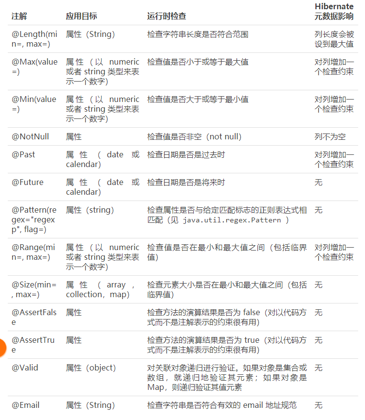

### 2-1 Spring Boot基础Web开发的支持 - 上
* JSON支持，包括单元测试
* 请求传参的各种方式

### 2-1 Spring Boot基础Web开发的支持 - 下
* 数据校验
    * Spring 自带框架
    * JSR
    
    * 自定义Filter，创建，设置order
        * @WebFilter
        * FilterRegistrationBean
    * 配置文件
        * 读取单个配置项 @Value
        * 读取多个配置项
        * 自定义配置文件